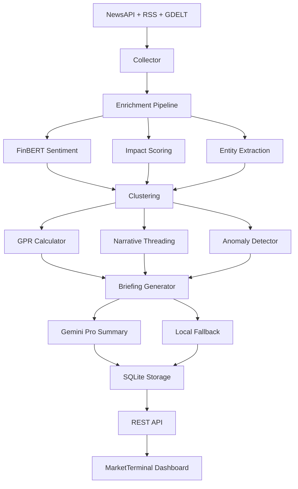

# Market Intelligence Platform - Architecture

## System Overview

A real-time market intelligence platform that ingests news from multiple sources, enriches it with NLP-powered sentiment analysis, clusters related articles, tracks geopolitical risk, and synthesizes actionable briefings.

## Pipeline Flow

```
Ingestion → Enrichment → Clustering → Metrics → Synthesis → Dashboard
```

### 1. Ingestion Layer (`server/intelligence/ingestion/`)
- **collector.ts** — Orchestrates article collection from multiple providers
- **Providers**: NewsAPI, RSS feeds, GDELT
- Hash-based idempotence prevents duplicate API calls

### 2. Enrichment Layer (`server/intelligence/enrichment/`)
- **sentiment.ts** — FinBERT via `transformers.js` for sentiment analysis (-100 to +100)
- **impact.ts** — Impact scoring with dynamically optimized weights
- **entities.ts** — Named entity extraction (people, orgs, places)
- **pipeline.ts** — Orchestrates enrichment steps for each article

### 3. Clustering Layer (`server/intelligence/clustering/`)
- **pipeline.ts** — TF-IDF + K-means clustering of related articles
- **narrative.ts** — Cross-day narrative threading with AND-based matching

### 4. Metrics Layer (`server/intelligence/metrics/`)
- **gpr.ts** — Geopolitical Risk Index calculation (0-100)
- **entity-tracker.ts** — Entity sentiment tracking over time
- **anomaly.ts** — Z-score volume anomaly detection
- **feedback.ts** — User sentiment/impact feedback collection

### 5. Validation Layer (`server/intelligence/validation/`)
- **backtest.ts** — Sentiment vs. market return backtesting
- **correlation.ts** — Pearson & Spearman correlation engines
- **market-data.ts** — Finnhub API market data fetcher
- **weight-optimizer.ts** — Grid search for optimal impact score weights
- **scorecard.ts** — Weekly accuracy scorecard generation

### 6. Synthesis Layer (`server/intelligence/synthesis/`)
- **briefing.ts** — Daily briefing generation with cache
- **gemini.ts** — Gemini Pro executive summary generation
- **signal.ts** — Rule-based single-sentence signal generator

### 7. Core (`server/intelligence/core/`)
- **storage.ts** — SQLite via `better-sqlite3`
- **pipeline.ts** — Main orchestrator with health monitoring
- **health.ts** — Pipeline step tracking for observability
- **types.ts** — Shared TypeScript interfaces
- **cache.ts** — Briefing cache with hash-based invalidation

## Data Flow



## Database Schema (SQLite)

Key tables: `raw_articles`, `enriched_articles`, `article_clusters`, `gpr_history`, `daily_briefings`, `entity_sentiment`, `narrative_threads`, `backtest_results`, `daily_volume`, `optimized_weights`, `weekly_scorecard`, `pipeline_health`

## API Endpoints

| Endpoint | Method | Description |
|---|---|---|
| `/api/intelligence/analysis` | GET | Full intelligence briefing |
| `/api/intelligence/run` | POST | Trigger pipeline run |
| `/api/intelligence/signal` | GET | Today's actionable signal |
| `/api/intelligence/scorecard` | GET | Weekly accuracy report |
| `/api/intelligence/scorecard/history` | GET | Historical scorecards |
| `/api/intelligence/backtest` | GET | Latest backtest results |
| `/api/intelligence/backtest/run` | GET | Run fresh backtest |
| `/api/intelligence/optimize-weights` | GET | Trigger weight optimization |
| `/api/intelligence/current-weights` | GET | Get active impact weights |
| `/api/intelligence/health` | GET | Pipeline health summary |
| `/api/intelligence/narratives` | GET | Narrative threads |
| `/api/intelligence/anomalies` | GET | Anomaly alerts |
| `/api/intelligence/entities/top` | GET | Top entities |
| `/api/intelligence/entity/:name` | GET | Entity timeline |
| `/api/intelligence/gpr` | GET | GPR history |
| `/api/intelligence/clusters` | GET | Clusters by date |
| `/api/intelligence/market-data` | GET | Cached market data |
